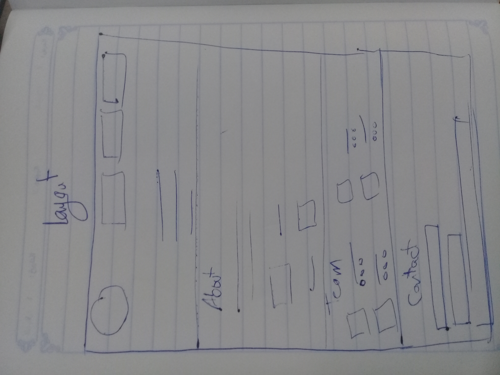
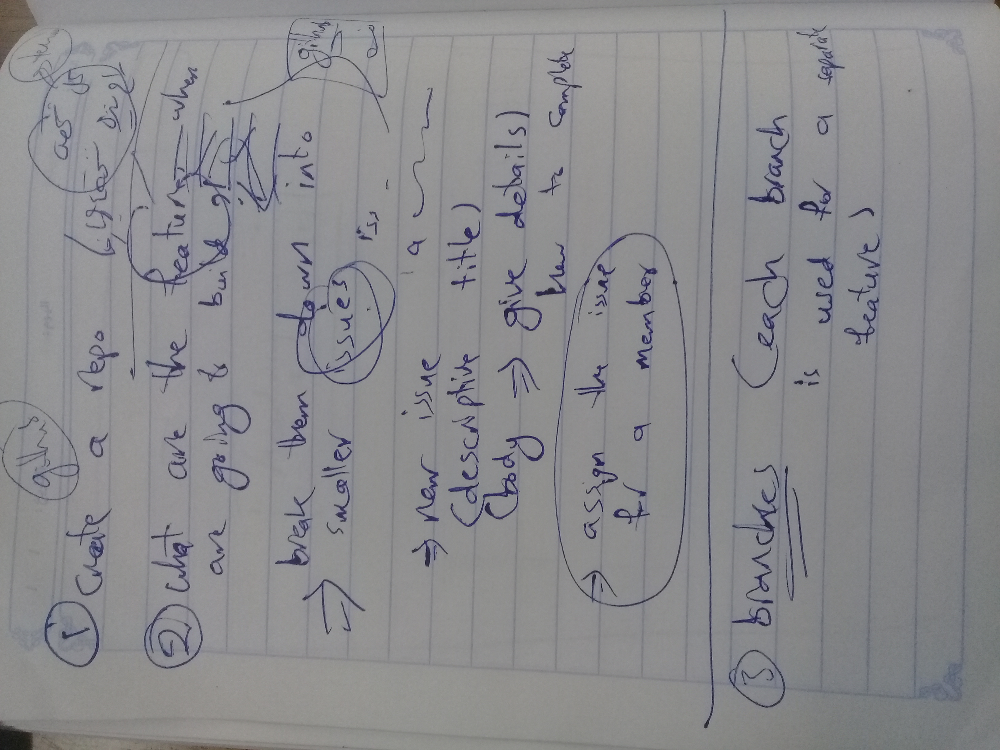

# code-wizards

## Our Blog Link: 

## Why did we create this blog?
* to market our services: building websites, desktop apps, blogs, etc..
* to show the clients our work and how professional we are
* to tell the clients more about our team members and show their official
* to let the clients contact with our team

## What does our blog talk about?
Our blog consists of four sections:
* The first section has a navigation bar to make navigating around our blog much easier.
* The second section is "About" section to show the clients the websites that we built and to show our clients' feedback.
* The third section is to tell the clients more about our team members and their backgrounds.
* The forth section is a form to let clients contact with our team members in order to have opportunities to cooperate together and duild therir sites.

## How was our team journey through building this blog?
* First, we drew a sketch as a first plan for our blog

* Second, we discussed our plan together and edited it.
* Third, we drew the final layout.
* Forth, we divided the four sections on our team members.
* Fifth, members started writing their sections.
* Sixth, members helped each other to solve the problems they faced.
* Seventh, team members pushed their files

* Eighth, conflicts started to appear, so we work on solvinr them (designs didn't go well together, javascript didn't work)
* Ninth, members worked in pairs; one pair worked on writing ReadMe, the other pair worked on solving problems
* last but not least, team submitted their work.

## Strech Goals:
These are the user stories that should be satisfied;

* As a client looking to hire a team of developers

I want to visit your site and immediately see a headline about your team

So that I get a concise description of what you have to offer me.

* As a client looking to hire a team of developers

I want to visit your site and see a navigation link for 'About, Team, and Contact'

so I can quickly navigate to the areas of the site I'd like to visit.

A* s a client looking to hire a team of developers

I want to be able to contact the developers by filling out and submitting a form by providing my name, email and message information

So that the team have sufficient information to contact me afterwards

* As a client looking to hire a team of developers

I want to click on a navigation link and a corresponding section be made visible in the browser window on the same page

So that I can quickly navigate around the site without having to wait for new pages to be loaded.

* As a client looking to hire a team of developers

I want to easily view the site when browsing on my mobile, tablet or desktop

so that I can understand the sites content easily on whatever device I choose to view it in.

* As a visually impaired client...

I would like to easily read and understand the text on your site

so I can understand the information available

* As a blind client...

I would like to easily understand how to navigate the site after my screen reader reads me the content of the site

so I can understand the information available.